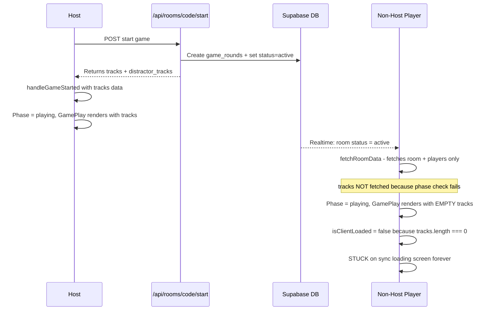
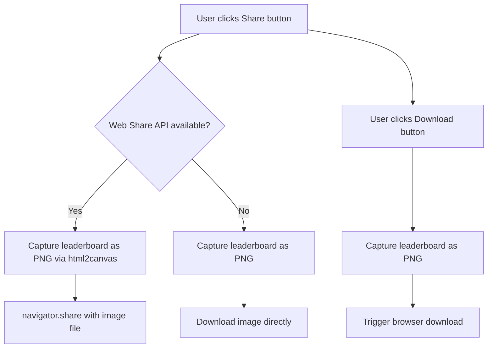

# Plan: Match Sync Fix + Shareable Leaderboard Image

## Feature 1: Match Sync Loading Screen Fix

### Root Cause Analysis

The bug: **Host can play the entire quiz while non-host players are stuck on a loading animation forever.**

#### Current Flow (Broken for Non-Host)



#### The Problem in Code

1. **`RoomClient.tsx` line 50**: `fetchRoomData()` only fetches tracks when `phase === 'playing' || phase === 'finished'`, but the fetch runs BEFORE the phase is set to `playing` (line 93: `fetchRoomData().then(() => setPhase('playing'))`)
2. **`RoomClient.tsx` line 92-93**: Even after phase changes, the tracks fetch uses `supabase.from('game_rounds')` which requires the room.id — but the tracks array passed to GamePlay remains empty because `fetchRoomData` sets tracks via `setTracks()` but GamePlay receives them as props
3. **`GamePlay.tsx` line 64**: `isClientLoaded = rounds.length > 0 && tracks.length > 0` — non-host has `tracks.length === 0` so they never become "loaded"

### Fix Strategy

The fix needs to ensure non-host players load tracks data before or during the GamePlay component mount. Two changes are needed:

#### Change 1: Fix `fetchRoomData` in `RoomClient.tsx`

The `fetchRoomData` function checks `phase` to decide whether to fetch tracks, but when called from the realtime handler (line 93), the phase is still `selecting` — not `playing` yet. We need to either:
- Pass a parameter to force track fetching regardless of phase
- OR fetch tracks in the realtime handler after phase transition

**Approach**: Add a `forceTrackFetch` parameter to `fetchRoomData`:

```typescript
const fetchRoomData = useCallback(async (forceTrackFetch = false) => {
  // ... existing room/player fetch ...
  
  // Fetch tracks when in game phase OR when forced
  if (json.data?.room?.id && (forceTrackFetch || phase === 'playing' || phase === 'finished')) {
    // fetch game_rounds and tracks...
  }
}, [roomCode, phase]);
```

Then in the realtime handler:
```typescript
if (newRoom.status === 'active' && (phase === 'selecting' || phase === 'lobby')) {
  fetchRoomData(true).then(() => setPhase('playing'));
}
```

#### Change 2: Make GamePlay self-sufficient for track loading

As a safety net, `GamePlay.tsx` should also be able to fetch its own tracks if the props are empty. This handles edge cases where the component mounts before tracks are available.

Add a `useEffect` in GamePlay that fetches tracks from the DB if `tracks.length === 0`:

```typescript
useEffect(() => {
  if (tracks.length > 0 || !room?.id) return;
  
  const fetchTracks = async () => {
    const { data: rounds } = await supabase
      .from('game_rounds')
      .select('track_id')
      .eq('room_id', room.id);
    
    if (rounds && rounds.length > 0) {
      const trackIds = rounds.map(r => r.track_id);
      const { data: dbTracks } = await supabase
        .from('tracks')
        .select('*')
        .in('id', trackIds);
      
      if (dbTracks && dbTracks.length > 0) {
        setLocalTracks(dbTracks as Track[]);
      }
    }
  };
  fetchTracks();
}, [room?.id, tracks.length]);
```

#### Change 3: Add distractor tracks fallback for non-host

Non-host players never receive `distractor_tracks` from the API. GamePlay should fetch distractors independently if the prop is empty. This can be done via a new API endpoint or by using the existing tracks pool.

### Files to Modify

| File | Change |
|------|--------|
| `apps/frontend/components/RoomClient.tsx` | Fix `fetchRoomData` to accept `forceTrackFetch` param; update realtime handler |
| `apps/frontend/components/GamePlay.tsx` | Add self-sufficient track loading fallback; add local tracks state that merges props + fetched |
| `apps/frontend/app/api/rooms/[code]/route.ts` | Optionally: include tracks in room GET response when status is active |

---

## Feature 2: Shareable Leaderboard Image

### Approach: Dual Strategy

1. **Client-side**: Use `html2canvas` to capture the leaderboard as a PNG, then offer download + Web Share API
2. **Server-side**: Create a Next.js API route using `@vercel/og` (ImageResponse) to generate an OG-style image for link sharing with WhatsApp preview

### 2A: Client-Side Screenshot + Share

#### New Component: `ShareLeaderboard.tsx`

A button/section in the Leaderboard component that:
1. Renders a "share-ready" version of the leaderboard in a hidden/styled div
2. Uses `html2canvas` to capture it as a PNG blob
3. Offers two actions:
   - **Download**: Creates a download link for the image
   - **Share**: Uses the Web Share API (`navigator.share()`) to share the image directly to WhatsApp/social media



#### Share Card Design

The shareable image should be a self-contained card with:
- muze branding/logo
- Room name (if set)
- Final rankings with scores
- Number of rounds played
- Most played artist
- A "Play at muze.games" call-to-action

### 2B: Server-Side OG Image for Link Preview

#### New API Route: `/api/rooms/[code]/og`

Uses `@vercel/og` (Next.js ImageResponse) to generate a dynamic OG image:
- Takes room code as parameter
- Fetches leaderboard data from Supabase
- Renders a styled image with rankings

#### Metadata for WhatsApp Preview

Add dynamic metadata to the room page so when the leaderboard URL is shared, WhatsApp shows a rich preview:
- Title: "muze - [Winner] won!"
- Description: "Final scores: Player1: 850pts, Player2: 620pts..."
- Image: The OG image from the API route

### New Dependencies

| Package | Purpose |
|---------|---------|
| `html2canvas` | Client-side DOM-to-image capture |
| `@vercel/og` | Server-side OG image generation (already included with Next.js 15+) |

### Files to Create/Modify

| File | Action | Description |
|------|--------|-------------|
| `apps/frontend/components/ShareLeaderboard.tsx` | CREATE | Share button component with html2canvas capture |
| `apps/frontend/components/LeaderboardCard.tsx` | CREATE | Styled card component optimized for image capture |
| `apps/frontend/components/Leaderboard.tsx` | MODIFY | Integrate ShareLeaderboard component |
| `apps/frontend/app/api/rooms/[code]/og/route.tsx` | CREATE | OG image generation endpoint |
| `apps/frontend/app/room/[code]/page.tsx` | MODIFY | Add dynamic OG metadata |
| `apps/frontend/package.json` | MODIFY | Add `html2canvas` dependency |

---

## Implementation Order

1. Fix match sync bug (Feature 1) — highest priority since it's a blocking bug
2. Add client-side leaderboard screenshot + share (Feature 2A)
3. Add server-side OG image generation (Feature 2B)
